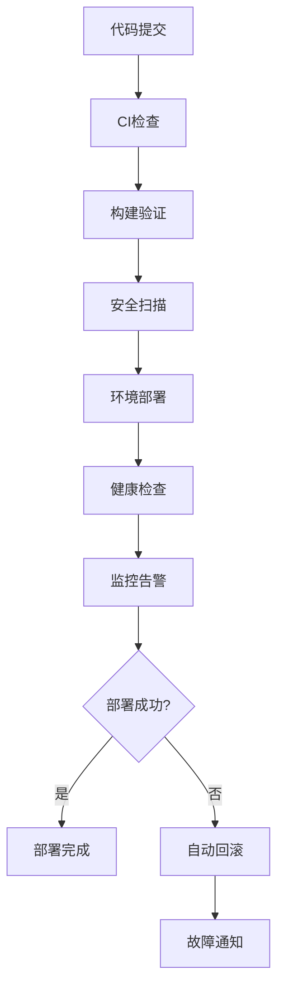

# 🔄 CI/CD流程详细指南

## 📋 概述

本指南详细说明了项目的持续集成和持续部署(CI/CD)流程，帮助开发者理解和使用自动化部署系统。

## 🏗️ CI/CD架构

### 工作流组件



### 工作流文件说明

| 文件 | 用途 | 触发条件 |
|------|------|----------|
| `ci.yml` | 代码质量检查 | Push/PR到main/develop |
| `deploy.yml` | 多环境部署 | Push到main/develop, PR |
| `database.yml` | 数据库迁移 | 数据库文件变更 |
| `monitor.yml` | 部署监控 | 部署完成后 |
| `rollback.yml` | 自动回滚 | 手动触发/故障检测 |
| `env-security.yml` | 环境安全检查 | 环境文件变更/定期 |

## 🚀 CI流程详解

### 1. 代码质量检查 (ci.yml)

#### 触发条件
- Push到 `main` 或 `develop` 分支
- 针对 `main` 或 `develop` 的Pull Request

#### 检查项目
```yaml
jobs:
  quality-check:
    - ESLint代码风格检查
    - TypeScript类型检查
    - 构建验证
    - 服务配置检查
  
  security-scan:
    - npm audit依赖漏洞扫描
    - audit-ci安全审计
  
  structure-check:
    - 必需文件检查
    - 目录结构验证
  
  status-report:
    - 汇总报告生成
    - 下一步指导
```

#### 本地运行CI检查
```bash
# 运行完整CI检查
npm run ci:test

# 单独运行各项检查
npm run lint              # ESLint检查
npm run type-check        # TypeScript检查
npm run check-services    # 服务配置检查
npm run audit:security    # 安全审计
```

### 2. 环境安全检查 (env-security.yml)

#### 触发条件
- 环境变量文件变更
- 每周定期扫描
- 手动触发

#### 检查内容
- 敏感数据泄露扫描
- 环境文件安全性检查
- 配置完整性验证
- 默认值安全检查

## 🚢 CD流程详解

### 1. 多环境部署 (deploy.yml)

#### Preview部署 (PR环境)
```yaml
触发: PR创建/更新
环境: preview
流程:
  1. 构建项目
  2. 部署到Vercel Preview
  3. PR评论通知预览URL
  4. 基础健康检查
```

#### Staging部署 (预发布环境)
```yaml
触发: Push到develop分支
环境: staging
流程:
  1. 预部署检查
  2. 构建项目
  3. 部署到Staging环境
  4. 健康检查验证
  5. 状态通知
```

#### Production部署 (生产环境)
```yaml
触发: Push到main分支
环境: production
保护: GitHub Environment保护规则
流程:
  1. 全面预检查
  2. 构建项目
  3. 部署到Production
  4. 完整验证
  5. 部署报告
```

### 2. 数据库迁移 (database.yml)

#### 触发条件
- `sql/` 或 `migrations/` 目录文件变更
- 手动触发

#### 迁移流程
```yaml
validate-migrations:
  - SQL语法检查
  - 迁移脚本验证
  - 模拟执行检查

migrate-staging:
  - 执行迁移脚本
  - 验证迁移结果
  - 检查迁移状态

migrate-production:
  - 预迁移备份检查
  - 执行迁移脚本
  - 全面验证
  - 生成迁移报告
```

## 📊 监控和通知

### 1. 部署监控 (monitor.yml)

#### 监控类型
- **部署后监控**: 部署完成后自动触发
- **定期健康检查**: 每小时检查生产环境
- **手动监控**: 支持手动触发特定检查

#### 监控内容
```yaml
健康检查:
  - 主页面可访问性
  - API端点健康状态
  - 关键功能页面验证
  - 数据库连接检查

性能监控:
  - 响应时间测试
  - 可用性统计
  - 错误率监控
  - 资源使用情况
```

### 2. 通知系统

#### 通知渠道
- **Slack**: 部署状态和告警
- **Discord**: 团队协作通知
- **GitHub**: PR评论和状态检查
- **邮件**: 关键事件通知

#### 通知内容
```yaml
部署开始:
  - 部署环境和版本信息
  - 触发分支和提交信息
  - 预计完成时间

部署完成:
  - 部署结果和耗时
  - 部署URL和验证状态
  - 关键指标摘要

部署失败:
  - 失败原因和错误信息
  - 建议的修复步骤
  - 回滚操作指导
```

## 🔄 回滚机制

### 1. 自动回滚触发条件

```yaml
健康检查失败:
  - 主要端点不可访问
  - API响应异常
  - 数据库连接失败

性能降级:
  - 响应时间超过阈值
  - 错误率过高
  - 可用性低于标准

连续失败:
  - 1小时内连续3次部署失败
  - 关键环境部署异常
```

### 2. 回滚类型

- **部署回滚**: 回滚到上一个稳定的Vercel部署
- **数据库回滚**: 回滚数据库迁移到指定版本
- **配置回滚**: 回滚环境变量和配置文件
- **完整回滚**: 包含上述所有类型的完整回滚

## 🔧 开发者工作流

### 1. 功能开发流程

```bash
# 1. 创建功能分支
git checkout -b feature/new-feature

# 2. 开发和测试
npm run dev
npm run test
npm run lint

# 3. 提交代码
git add .
git commit -m "feat: add new feature"

# 4. 推送并创建PR
git push origin feature/new-feature
# 在GitHub创建PR -> 自动触发Preview部署

# 5. 代码审查通过后合并到develop
# 自动触发Staging部署

# 6. Staging验证通过后合并到main
# 自动触发Production部署
```

### 2. 部署前检查清单

```bash
# 代码质量检查
- [ ] npm run lint 通过
- [ ] npm run type-check 通过
- [ ] npm run test 通过
- [ ] npm run build 成功

# 环境配置检查
- [ ] npm run env:validate 通过
- [ ] npm run check-services 通过
- [ ] npm run verify-supabase 通过

# 安全检查
- [ ] npm run audit:security 通过
- [ ] 环境变量正确配置
- [ ] 敏感信息未泄露

# 数据库检查
- [ ] npm run db:status 正常
- [ ] 迁移脚本已测试
- [ ] 备份策略已确认
```

### 3. 故障处理流程

```bash
# 1. 检测到部署失败
# 查看GitHub Actions日志

# 2. 本地复现问题
npm run ci:check
npm run build

# 3. 修复问题
# 根据错误信息修复代码

# 4. 重新部署
git add .
git commit -m "fix: resolve deployment issue"
git push

# 5. 如果问题严重，考虑回滚
npm run rollback:deployment production
```

## 📈 性能优化

### 1. CI/CD性能优化

- **缓存策略**: 依赖缓存、构建缓存
- **并行执行**: 多个检查并行运行
- **增量构建**: 只构建变更部分
- **资源优化**: 合理分配CI资源

### 2. 部署性能优化

- **构建优化**: 代码分割、Tree Shaking
- **缓存策略**: CDN缓存、浏览器缓存
- **资源压缩**: 图片、CSS、JS压缩
- **预加载**: 关键资源预加载

## 📚 最佳实践

### 1. 分支管理

- **main**: 生产环境，只接受来自develop的合并
- **develop**: 开发主分支，功能分支合并目标
- **feature/***: 功能开发分支
- **hotfix/***: 紧急修复分支

### 2. 提交规范

```bash
# 提交消息格式
<type>(<scope>): <description>

# 类型说明
feat: 新功能
fix: 修复bug
docs: 文档更新
style: 代码格式调整
refactor: 代码重构
test: 测试相关
chore: 构建过程或辅助工具的变动
```

### 3. 环境管理

- **环境隔离**: 不同环境使用独立配置
- **配置管理**: 使用GitHub Secrets管理敏感信息
- **版本控制**: 环境配置版本化管理
- **安全审计**: 定期检查环境安全性

---

**💡 提示**: CI/CD系统需要定期维护和优化，建议每月检查一次工作流性能和安全性。
