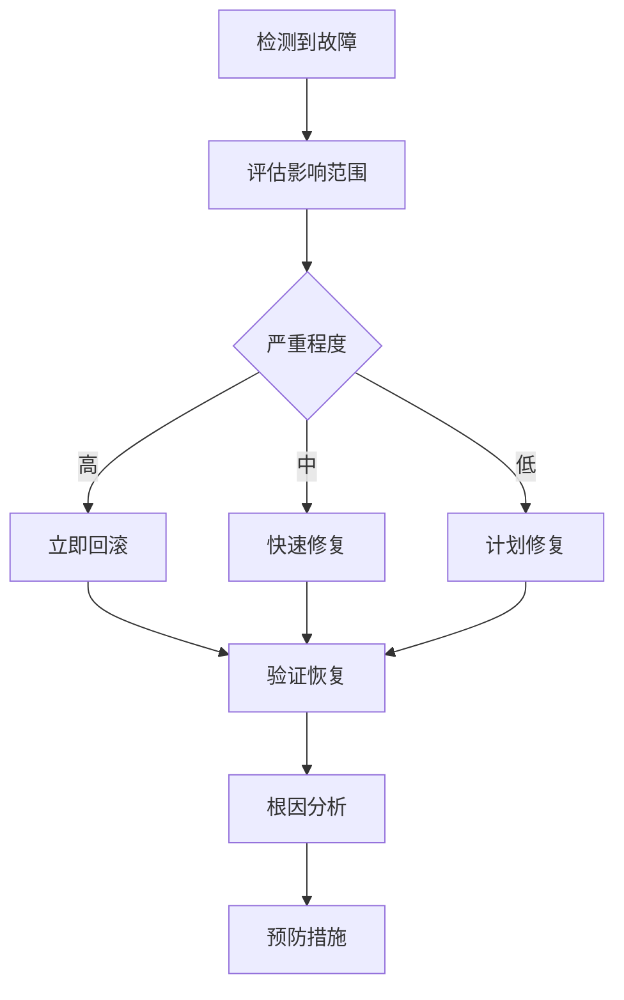

# 🔧 部署故障排除指南

## 📋 概述

本指南提供了自动化部署系统常见问题的诊断和解决方案，帮助开发者快速定位和修复部署相关问题。

## 🚨 紧急故障处理

### 生产环境故障

如果生产环境出现严重问题：

1. **立即评估影响范围**
   ```bash
   # 检查生产环境状态
   npm run monitor:health https://your-domain.com
   ```

2. **考虑紧急回滚**
   ```bash
   # 快速回滚到上一个稳定版本
   npm run rollback:deployment production
   
   # 或通过GitHub Actions
   # Actions > Automatic Rollback > Run workflow
   ```

3. **通知相关人员**
   - 技术团队
   - 产品负责人
   - 客户支持团队

## 🔍 常见问题诊断

### 1. CI/CD工作流失败

#### GitHub Actions构建失败

**症状**: GitHub Actions显示红色❌状态

**诊断步骤**:
```bash
# 1. 查看GitHub Actions日志
# 访问 GitHub > Actions > 失败的工作流 > 查看详细日志

# 2. 本地复现问题
git checkout <failing-commit>
npm ci
npm run ci:check

# 3. 检查具体失败原因
npm run lint          # 代码风格检查
npm run type-check    # TypeScript检查
npm run build         # 构建检查
npm run test          # 测试检查
```

**常见原因和解决方案**:

| 错误类型 | 可能原因 | 解决方案 |
|----------|----------|----------|
| ESLint错误 | 代码风格不符合规范 | `npm run lint -- --fix` |
| TypeScript错误 | 类型定义错误 | 修复类型错误，检查类型定义 |
| 构建失败 | 依赖问题或代码错误 | 检查依赖版本，修复代码错误 |
| 测试失败 | 测试用例失败 | 修复测试或更新测试用例 |

#### 环境变量配置错误

**症状**: 部署成功但功能异常

**诊断步骤**:
```bash
# 1. 验证环境变量配置
npm run env:validate

# 2. 检查特定环境配置
npm run env:check

# 3. 验证服务连接
npm run check-services
npm run verify-supabase
```

**解决方案**:
```bash
# 1. 检查GitHub Secrets配置
# Settings > Secrets and variables > Actions

# 2. 验证环境变量格式
# 确保URL、密钥格式正确

# 3. 重新生成密钥（如果需要）
# 在Supabase/Vercel控制台重新生成
```

### 2. 部署失败问题

#### Vercel部署超时

**症状**: 部署过程中超时失败

**诊断步骤**:
```bash
# 1. 检查构建时间
npm run build
# 记录构建耗时

# 2. 检查依赖大小
npm ls --depth=0
du -sh node_modules/

# 3. 检查Vercel配额
# 访问Vercel Dashboard查看使用情况
```

**解决方案**:
```bash
# 1. 优化构建性能
# 移除不必要的依赖
npm uninstall <unused-package>

# 2. 启用构建缓存
# 在vercel.json中配置缓存

# 3. 分析包大小
npm run analyze
# 或使用webpack-bundle-analyzer
```

#### 数据库迁移失败

**症状**: 数据库迁移工作流失败

**诊断步骤**:
```bash
# 1. 检查迁移状态
npm run db:status

# 2. 验证SQL语法
# 检查migrations/目录下的SQL文件

# 3. 测试数据库连接
npm run verify-supabase
```

**解决方案**:
```bash
# 1. 修复SQL语法错误
# 检查并修复SQL文件中的语法问题

# 2. 手动执行迁移
npm run db:migrate

# 3. 回滚有问题的迁移
npm run db:rollback <migration-version>
```

### 3. 环境特定问题

#### Staging环境问题

**症状**: Staging部署成功但功能异常

**诊断步骤**:
```bash
# 1. 检查staging环境健康状态
npm run monitor:health https://staging.your-domain.com

# 2. 比较环境配置差异
# 对比.env.staging和.env.production

# 3. 检查staging数据库状态
# 使用staging环境的Supabase配置
```

**解决方案**:
```bash
# 1. 同步环境配置
# 确保staging环境配置正确

# 2. 重新部署staging
git push origin develop

# 3. 重置staging数据库（如果需要）
# 在Supabase控制台重置staging数据库
```

#### Production环境问题

**症状**: Production部署后出现问题

**诊断步骤**:
```bash
# 1. 立即检查生产环境状态
npm run monitor:health https://your-domain.com

# 2. 查看部署日志
# GitHub Actions > Deploy to Vercel > 查看日志

# 3. 检查错误监控
# 查看Vercel Analytics或其他监控工具
```

**解决方案**:
```bash
# 1. 如果问题严重，立即回滚
npm run rollback:deployment production

# 2. 如果问题轻微，推送修复
git add .
git commit -m "fix: resolve production issue"
git push origin main

# 3. 监控修复效果
npm run monitor:health https://your-domain.com
```

## 🔧 调试工具和技巧

### 1. 本地调试

#### 模拟CI环境
```bash
# 设置CI环境变量
export CI=true
export NODE_ENV=production

# 运行CI检查
npm run ci:check
npm run ci:build
```

#### 本地健康检查
```bash
# 启动本地服务
npm run dev

# 在另一个终端运行健康检查
npm run monitor:health http://localhost:3000
```

### 2. 远程调试

#### 查看Vercel日志
```bash
# 安装Vercel CLI
npm i -g vercel

# 登录并查看日志
vercel login
vercel logs <deployment-url>
```

#### 查看Supabase日志
```bash
# 在Supabase Dashboard中查看
# Logs > API/Database/Auth 日志
```

### 3. 性能调试

#### 分析构建性能
```bash
# 分析构建时间
npm run build -- --profile

# 分析包大小
npm run analyze
```

#### 监控运行时性能
```bash
# 使用内置性能监控
npm run monitor:health <url>

# 查看详细性能指标
# 在浏览器开发者工具中查看Network和Performance
```

## 📊 监控和告警

### 1. 设置监控告警

#### GitHub Actions通知
```yaml
# 在工作流中添加失败通知
- name: Notify on failure
  if: failure()
  run: |
    # 发送Slack通知
    curl -X POST -H 'Content-type: application/json' \
      --data '{"text":"部署失败: ${{ github.workflow }}"}' \
      ${{ secrets.SLACK_WEBHOOK_URL }}
```

#### 健康检查告警
```bash
# 设置定期健康检查
# 在monitor.yml中配置定期检查

# 配置告警阈值
# 响应时间 > 5秒
# 错误率 > 5%
# 可用性 < 95%
```

### 2. 日志收集和分析

#### 集中化日志管理
```bash
# 收集应用日志
# 配置日志输出到统一位置

# 分析错误模式
# 使用日志分析工具识别常见问题
```

#### 性能指标收集
```bash
# 收集关键指标
# - 部署频率
# - 部署成功率
# - 平均恢复时间
# - 变更失败率
```

## 🔄 故障恢复流程

### 1. 故障响应流程



### 2. 故障后分析

#### 根因分析模板
```markdown
## 故障报告

**故障时间**: 2024-01-01 10:00 - 10:30 UTC
**影响范围**: 生产环境，约1000用户
**严重程度**: 高

### 故障描述
详细描述故障现象和影响

### 根本原因
分析导致故障的根本原因

### 解决方案
描述采取的解决措施

### 预防措施
1. 改进部署前检查
2. 增强监控告警
3. 完善回滚机制

### 经验教训
总结从此次故障中学到的经验
```

## 📚 参考资源

### 1. 官方文档
- [GitHub Actions文档](https://docs.github.com/en/actions)
- [Vercel部署文档](https://vercel.com/docs)
- [Supabase文档](https://supabase.com/docs)

### 2. 内部文档
- [CI/CD流程指南](./ci-cd-guide.md)
- [回滚操作指南](./rollback-guide.md)
- [环境变量管理](./github-secrets-setup.md)

### 3. 工具和命令

#### 快速诊断命令
```bash
# 全面健康检查
npm run check-services

# 环境配置验证
npm run env:validate

# 数据库状态检查
npm run verify-supabase

# CI环境检查
npm run ci:check
```

#### 紧急操作命令
```bash
# 紧急回滚
npm run rollback:deployment production

# 查看回滚状态
npm run rollback:status

# 健康检查
npm run monitor:health <url>
```

---

**🚨 重要提醒**: 
- 遇到问题时保持冷静，按照流程逐步排查
- 重要操作前先在staging环境测试
- 及时记录问题和解决方案，完善知识库
- 定期回顾和优化故障处理流程
